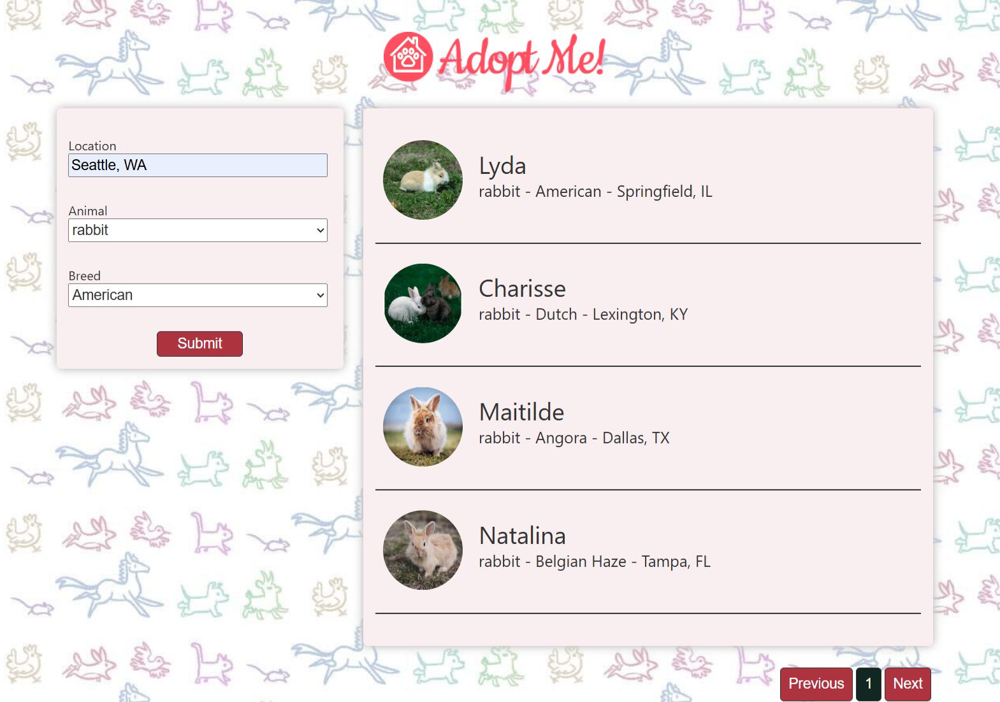
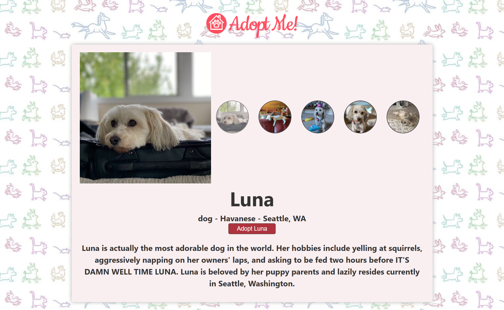

# 🐾 Adopt Me – Web-Based Pet Adoption Platform

**Adopt Me** is a modern, fast, and responsive web application built with **React + Vite** that enables users to browse, search, and adopt pets. Whether you're looking for a playful puppy, a sleepy cat, or something more exotic, Adopt Me makes finding your perfect companion simple and joyful.

## ✨ Features

- 🐶 Browse available pets with images and descriptions
- 🔍 Search and filter by location, animal and breed
- 📄 Detailed pet profiles with personality traits and photos carousel
- 💚 "Adopt" feature to express interest in a pet
- 📱 Responsive UI for mobile, tablet, and desktop

## 🧰 Tech Stack

- **Frontend:** React + Vite
- **Styling:** CSS
- **State Management:** React Context / useState
- **Routing:** React Router DOM
- **API:** Fetching live pet data from the open API at 🔗 [https://pets-v2.dev-apis.com](https://pets-v2.dev-apis.com/pets) used in the *Frontend Masters - Intermediate React* course.

---

## 🚀 Getting Started

### 🛠️ Prerequisites

Make sure you have the following installed:
- Node.js (v16 or higher)
- npm or yarn

### 📦 Installation

1. **Clone the repository:**
```bash
git clone https://github.com/saradotdev/Adopt-Me.git
cd Adopt-Me
```

2. **Install dependencies:**
```bash
npm install
```

3. **Run the development server:**
```bash
npm run dev
```

4. **Open in browser:**
```
http://localhost:5173
```

---

## 📸 UI Preview

🌐 **Live Site:** [https://browse-and-adopt-me.vercel.app/](https://browse-and-adopt-me.vercel.app/)

### 🏠 Home Page


### 📖 Pet Profile Detail


---

🐾 **Find your new best friend today with Adopt Me!**
